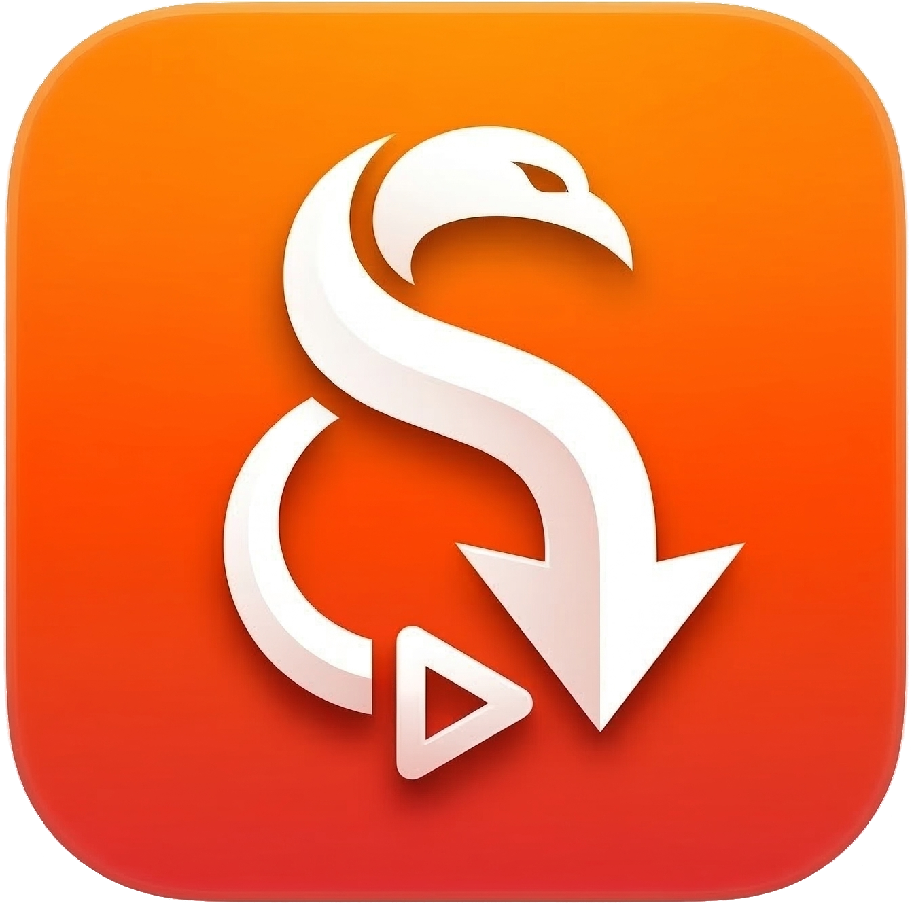

<p align="center">
  
</p>

<h1 align="center">yt-dlp-swift</h1>

<p align="center">
  macOS向け yt-dlp GUIアプリケーション<br>
  <em>A native macOS GUI for yt-dlp</em>
</p>

<p align="center">
  
  
  
  
</p>

---

## 特徴 / Highlights

- **ゼロ設定で開始** — yt-dlp, FFmpeg, Deno を自動ダウンロード・管理。インストールして起動するだけ
- **1800+ サイト対応** — YouTube, ニコニコ動画, TVer, ABEMA, TikTok, X, Bilibili ほか
- **12言語対応** — 日本語・英語・中国語(繁体/簡体)・韓国語・ロシア語・スペイン語・フランス語・ドイツ語・イタリア語・ポルトガル語
- **macOS ネイティブ** — SwiftUI 製。軽量で macOS に自然に馴染むデザイン
- **メニューバー常駐** — メニューバーから即座にURL入力 → ダウンロード
- **Cookie・ログイン対応** — アプリ内ブラウザでログインし、会員限定コンテンツも取得可能
- **オープンソース** — MIT License

---

## 動作要件 / Requirements

- **macOS 14 (Sonoma)** 以降
- Apple Silicon (M1/M2/M3/M4) または Intel Mac
- インターネット接続 (初回の依存ツールダウンロードに必要)

---

## インストール / Installation

### ソースからビルド

```bash
# クローン
git clone https://github.com/nagi/yt-dlp-swift.git
cd yt-dlp-swift

# Xcode プロジェクトを生成 (xcodegen が必要)
brew install xcodegen
xcodegen generate

# Xcode で開いてビルド
open yt-dlp-swift.xcodeproj
# ⌘R で実行
```

---

## 使い方 / Usage

### 基本的な流れ

1. **アプリを起動** — 初回は依存ツールが自動インストールされます
2. **URL を貼り付け** — テキストフィールドに動画の URL をペースト
3. **「取得」をクリック** — 動画情報 (サムネイル・タイトル・画質一覧) を自動取得
4. **画質・フォーマットを選択** — プリセットまたはカスタム指定
5. **「ダウンロード」をクリック** — リアルタイムで進捗が表示されます

### 一括ダウンロード

テキストフィールドに複数の URL を改行区切りで貼り付けると、自動的に一括ダウンロードモードに切り替わります。デフォルト画質で一括処理されます。

### メニューバーからダウンロード

設定 →「メニューバーに常駐」を ON にすると、メニューバーのアイコンから素早く URL を入力してダウンロードを開始できます。ダウンロード進捗もリアルタイムで確認可能です。

### ログインが必要なサイト

1. ツールバーの 🌐 アイコンから「対応サイト一覧」を開く
2. ログインが必要なサイトの「ログイン」ボタンをクリック
3. アプリ内ブラウザでログイン
4. 「Cookie を保存してログイン」をクリック
5. 以降のダウンロードに Cookie が自動適用されます

---

## 機能一覧 / Features

### ダウンロード

| 機能 | 詳細 |
|------|------|
| 画質プリセット | 最高画質 / 4K / 1080p / 720p / 480p |
| 音声抽出 | 最高音質 / MP3 / M4A / Opus |
| コンテナ形式 | MP4 (推奨) / MKV / WebM |
| カスタムフォーマット | yt-dlp `-f` 構文を直接入力 |
| ダウンロードキュー | 同時DL数 1〜5 設定可能 |
| リアルタイム進捗 | パーセント, 速度 (MiB/s), 残り時間 |
| フェーズ表示 | 映像DL → 音声DL → 後処理 (変換・結合) |
| 完了通知 | macOS 通知センターでお知らせ |
| 一括ダウンロード | 複数URLを改行区切りで一度にDL |
| 履歴保存 | ダウンロード履歴を永続化 |
| ファイル操作 | 完了後にFinder表示・ファイル再生 |

### 依存関係の自動管理

| ツール | 用途 | ソース |
|--------|------|--------|
| [yt-dlp](https://github.com/yt-dlp/yt-dlp) | 動画ダウンロードエンジン | GitHub Releases |
| [FFmpeg](https://ffmpeg.org/) / FFprobe | 動画変換・メディア解析 | evermeet.cx |
| [Deno](https://deno.land/) | JSランタイム (YouTube等で必要) | GitHub Releases |

- 初回起動時に未インストールのツールを自動ダウンロード・配置
- アプリ内からワンクリックで最新版に更新
- Homebrew 等でインストール済みのバイナリも自動検出・利用

### 対応サイト (1800+)

<details>
<summary>主な対応サイト一覧</summary>

**🇯🇵 日本のサービス**

| サービス | 備考 |
|---------|------|
| YouTube | JSランタイム必須 |
| ニコニコ動画 | ログイン対応 |
| ニコニコ生放送 | タイムシフト対応 |
| TVer | 期間限定配信 |
| ABEMA | 一部プレミアム限定 |
| NHK プラス / NHK for School | |
| TBS FREE | |
| テレ朝動画 | |
| フジテレビ (FOD) | |
| Radiko | ラジオ |
| ツイキャス | |
| SHOWROOM | |

**🎬 動画プラットフォーム**
YouTube, TikTok, Vimeo, Dailymotion, Reddit, Bilibili, PeerTube 等

**📱 SNS・ソーシャル**
Instagram, X (Twitter), Facebook, Threads, Pinterest, Tumblr, VK 等

**📺 ライブ配信**
Twitch, ツイキャス, SHOWROOM, ニコ生, AfreecaTV, Kick 等

**🎵 音楽**
Bandcamp, SoundCloud, Spotify (メタデータ), Radiko, Mixcloud 等

**🍿 ストリーミングサービス**
Crunchyroll, Amazon Prime Video, Disney+, Hulu, HBO Max, U-NEXT, iQIYI, Youku 等

**🇨🇳 中国のサービス**
Bilibili, Douyin (中国版TikTok), Kuaishou, Tencent Video, Xiaohongshu 等

**🇰🇷 韓国のサービス**
Naver TV, AfreecaTV, CHZZK, KakaoTV, Weverse, KBS, SBS 等

**📚 教育・ニュース**
TED, Khan Academy, BBC, CNN, ARTE, ARD, ZDF 等

### Cookie・ログイン対応

- アプリ内蔵ブラウザ (WKWebView) でサイトにログイン
- Cookie を Netscape 形式で自動保存、yt-dlp の `--cookies` に自動適用
- サイトごとの Cookie 管理 (再ログイン・ログアウト)
- ニコニコ動画、ABEMA 等のログイン必須サイトに対応

### 設定

| 項目 | 説明 | デフォルト |
|------|------|-----------|
| 言語 | UI言語 (12言語) | システム設定に従う |
| ダウンロード先 | 保存フォルダ | ~/Downloads |
| デフォルトフォーマット | 画質プリセット | 最高画質 |
| コンテナ形式 | MP4 / MKV / WebM | MP4 |
| 同時ダウンロード数 | 並列DL数 | 3 |
| ファイル名テンプレート | 出力ファイル名パターン | `%(title)s.%(ext)s` |
| メニューバー常駐 | メニューバーモード | OFF |
| クリップボード監視 | URL自動検出 | OFF |
| 追加引数 | yt-dlp 追加オプション (上級者向け) | (空) |

**ファイル名テンプレートのプリセット:**
- `%(title)s.%(ext)s` — タイトルのみ
- `%(title)s [%(id)s].%(ext)s` — タイトル + 動画ID
- `%(uploader)s/%(title)s.%(ext)s` — チャンネル名/タイトル
- `%(upload_date)s - %(title)s.%(ext)s` — 日付 - タイトル

---

## 技術スタック / Tech Stack

| 項目 | 技術 |
|------|------|
| 言語 | Swift 5.9+ |
| UI | SwiftUI (macOS 14+) |
| 状態管理 | @Observable (Observation framework) |
| 非同期処理 | Swift Concurrency (async/await) |
| プロセス実行 | Foundation.Process |
| ビルドツール | Xcode 15+ / XcodeGen |
| 外部 SPM 依存 | なし |

---

## プロジェクト構成 / Project Structure

```
yt-dlp-swift/
├── App/                        # エントリポイント・AppDelegate
├── Models/                     # データモデル
│   ├── VideoInfo.swift             # 動画メタデータ
│   ├── DownloadTask.swift          # DLタスク・ステータス
│   ├── DownloadFormat.swift        # フォーマット・プリセット
│   ├── SupportedSite.swift         # 対応サイト情報
│   └── AppSettings.swift           # ユーザー設定
├── ViewModels/                 # ビューモデル
│   ├── MainViewModel.swift         # メインウィンドウ
│   ├── DownloadViewModel.swift     # DL進捗管理
│   ├── SettingsViewModel.swift     # 設定
│   └── DependencyViewModel.swift   # 依存関係管理
├── Views/                      # SwiftUI ビュー
│   ├── MainView.swift              # メインウィンドウ
│   ├── URLInputView.swift          # URL入力
│   ├── VideoInfoView.swift         # 動画情報プレビュー
│   ├── FormatPickerView.swift      # 画質・フォーマット選択
│   ├── DownloadListView.swift      # DLキュー一覧
│   ├── DownloadRowView.swift       # DL行
│   ├── SettingsView.swift          # 設定画面
│   ├── DependencySetupView.swift   # 依存関係セットアップ
│   ├── SupportedSitesView.swift    # 対応サイト一覧
│   ├── LoginWebView.swift          # ログインブラウザ
│   ├── MenuBarView.swift           # メニューバー
│   └── AboutView.swift             # アプリ情報
├── Services/                   # ビジネスロジック
│   ├── YtDlpService.swift          # yt-dlp CLI ラッパー
│   ├── DownloadManager.swift       # DLキュー管理
│   ├── DependencyManager.swift     # 依存関係インストール・更新
│   ├── CookieManager.swift         # Cookie管理
│   ├── SiteRegistry.swift          # サイト一覧管理
│   └── OutputParser.swift          # yt-dlp 出力パーサー
├── Utilities/                  # ユーティリティ
│   ├── L10n.swift                  # 12言語ローカライズ
│   ├── ProcessRunner.swift         # プロセス実行
│   └── FileNameSanitizer.swift     # ファイル名サニタイズ
└── Resources/
    ├── SupportedSites.json         # 対応サイトマスターデータ
    ├── Assets.xcassets/            # アイコン・画像
    └── Info.plist
```

---

## ライセンス / License

MIT License

このアプリケーションが使用する以下のツールは、それぞれのライセンスに基づきます:

- [yt-dlp](https://github.com/yt-dlp/yt-dlp) — Unlicense
- [FFmpeg](https://ffmpeg.org/) — LGPL / GPL
- [Deno](https://deno.land/) — MIT

---

## クレジット / Credits

- [yt-dlp](https://github.com/yt-dlp/yt-dlp) — 動画ダウンロードエンジン
- [FFmpeg](https://ffmpeg.org/) — マルチメディアフレームワーク
- [Deno](https://deno.com/) — JavaScript ランタイム
